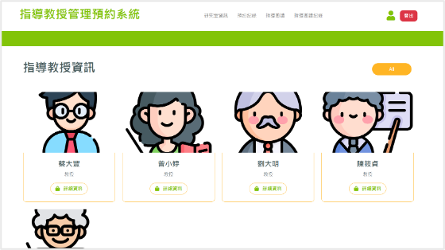
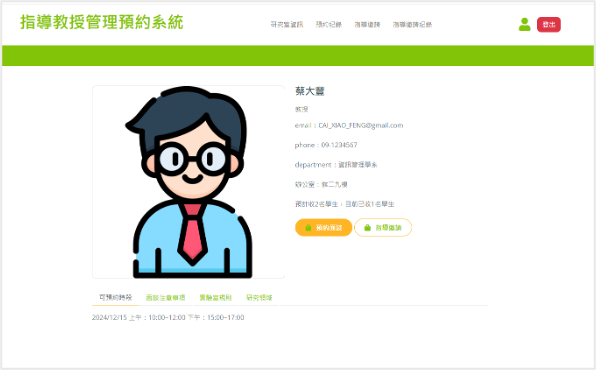
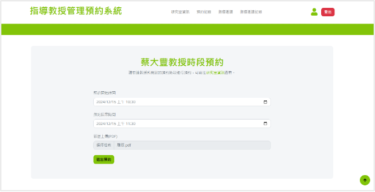
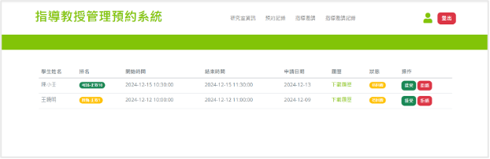

# 指導教授預約系統 (Appointment System)

> 國立中央大學資訊管理學系碩一軟體工程課程期末專案  
> 目標：建立研究生、教授、系辦三方可共同使用的預約與指導邀請平台。

---

## 目錄

- [專案亮點](#專案亮點)
- [專案背景](#專案背景)
- [功能總覽](#功能總覽)
- [系統畫面預覽](#系統畫面預覽)
- [技術架構](#技術架構)
- [快速開始 (5 分鐘)](#快速開始-5-分鐘)
- [環境變數設定](#環境變數設定)
- [資料庫需求](#資料庫需求)
- [專案結構](#專案結構)
- [測試摘要](#測試摘要)
- [常見問題 FAQ](#常見問題-faq)
- [Roadmap](#roadmap)
- [團隊與致謝](#團隊與致謝)
- [授權與用途](#授權與用途)

---

## 專案亮點

- 支援三種角色：研究生、教授、系辦（秘書）
- 完整預約流程：建立、審核、狀態更新、刪除、履歷上傳/下載
- 指導邀請流程：提交邀請、同意/拒絕、歷史紀錄追蹤
- MVC 分層架構，便於維護與擴充
- 已改為環境變數管理 DB 密碼，避免硬編碼機敏資訊

---

## 專案背景

研究生在找指導教授時，常遇到資訊不透明問題，例如：

- 教授是否仍開放收學生不明確
- 可預約時段、研究方向資訊分散
- 來回溝通成本高、重複詢問多

本系統希望降低資訊不對稱，讓：

- 研究生更快找到合適教授
- 教授減少無效往返信件
- 系辦更有效率地管理帳號與資料

---

## 功能總覽

### 研究生

- 瀏覽教授與研究室資訊
- 提出預約申請（支援履歷 PDF 上傳）
- 查看預約紀錄與狀態
- 發送指導邀請、查看邀請紀錄
- 修改個人資料

### 教授

- 維護可預約時段與預約開放狀態
- 審核預約申請（同意/拒絕）
- 查看與下載研究生履歷
- 維護研究室資訊（研究領域、規則、面談注意事項）
- 審核指導邀請（同意/拒絕）與查看歷史
- 修改個人資料

### 系辦（秘書）

- 新增研究生/教授帳號
- 瀏覽帳號清單
- 刪除帳號

---

## 系統畫面預覽

### 1) 登入頁面


### 2) 研究生首頁（教授列表）



### 3) 教授詳細資訊頁



### 4) 預約申請頁



### 5) 教授端預約審核頁



---

## 技術架構

- **後端**：Python、Flask
- **前端**：HTML5、JavaScript、Bootstrap、jQuery
- **資料庫**：MySQL
- **架構模式**：MVC
  - `Model`：`app/model/models.py`
  - `View`：`app/templates/`
  - `Controller`：`app/controller/routes.py`

---

## 快速開始 (5 分鐘)

### 1) 建立虛擬環境

```bash
python3 -m venv .venv
source .venv/bin/activate
```

### 2) 安裝套件

目前專案尚未附 `requirements.txt`，先安裝必要依賴：

```bash
pip install flask mysql-connector-python
```

### 3) 設定環境變數

```bash
export DB_HOST='localhost'
export DB_USER='root'
export DB_PASSWORD='請填入你的資料庫密碼'
export DB_NAME='appointment_system'
```

### 4) 啟動系統

```bash
python app.py
```

啟動後請開啟：`http://127.0.0.1:5000`

---

## 環境變數設定

| 變數名稱 | 是否必要 | 預設值 | 說明 |
|---|---|---|---|
| `DB_HOST` | 否 | `localhost` | MySQL 主機 |
| `DB_USER` | 否 | `root` | MySQL 使用者 |
| `DB_PASSWORD` | **是** | 無 | MySQL 密碼 |
| `DB_NAME` | 否 | `appointment_system` | 資料庫名稱 |

> 若未設定 `DB_PASSWORD`，系統會在啟動資料庫連線時拋出錯誤。

---

## 資料庫需求

請先建立 MySQL 資料庫與資料表。依目前程式碼，核心表包含：

- `account`
- `student`
- `professor`
- `otherinfo`
- `appointmentslot`
- `appointment`
- `mentorshiprequest`

### 狀態欄位定義

- **預約狀態 (`appointment.status`)**
  - `0`：待回覆
  - `1`：已確認
  - `2`：已拒絕
- **指導邀請狀態 (`mentorshiprequest.status`)**
  - `0`：待回覆
  - `1`：已同意
  - `2`：已拒絕

---

## 專案結構

```text
appointment_system_new/
├── app.py
├── .gitignore
├── app/
│   ├── __init__.py
│   ├── controller/
│   │   └── routes.py
│   ├── model/
│   │   └── models.py
│   ├── static/
│   │   ├── css/
│   │   ├── img/
│   │   ├── js/
│   │   └── resumes/
│   ├── templates/
│   │   ├── login.html
│   │   ├── student_dashboard.html
│   │   ├── teacher_dashboard.html
│   │   ├── secretary_dashboard.html
│   │   ├── appointment_*.html  # appointment_create/pro/stu
│   │   ├── mentorship_*.html   # mentorship_pro/stu/detail
│   │   ├── account_*.html      # account_create/pro/stu
│   │   ├── profile_*.html
│   │   └── view_pro_detail.html
├── docs/
│   └── images/
│       ├── login-page.png
│       ├── student-dashboard.png
│       ├── professor-detail.png
│       ├── appointment-create.png
│       └── appointment-review-teacher.png
└── README.md
```

---

## 測試摘要

本專案採灰箱測試，涵蓋單元測試、整合測試與壓力測試（Locust）。

### 壓力測試結果（摘要）

| 測試項目 | 系統開始出現錯誤門檻 |
|---|---|
| 登入功能 | 超過約 900 使用者 |
| 個人資料編輯送出 | 超過約 400 使用者 |
| 預約送出功能 | 超過約 400 使用者 |

---

## 常見問題 FAQ

### Q1. 為什麼啟動後出現 `缺少 DB_PASSWORD 環境變數`？

你尚未設定 `DB_PASSWORD`。請先在終端機執行：

```bash
export DB_PASSWORD='你的資料庫密碼'
```

### Q2. 我想改埠號或關閉 debug，怎麼做？

請調整 `app.py` 的 `app.run(...)` 參數，例如：

```python
app.run(host="0.0.0.0", port=5001, debug=False)
```

### Q3. 履歷檔案上傳後存在哪裡？

預設儲存在 `app/static/resumes/`。

### Q4. 如何避免機敏資訊再被提交到 Git？

請使用環境變數或 `.env`（且加入 `.gitignore`），不要把帳密寫在程式碼裡。

---

## Roadmap

- [ ] 新增 `requirements.txt` 或 `pyproject.toml`
- [ ] 導入 `.env` 自動載入（`python-dotenv`）
- [ ] 密碼改為雜湊儲存（目前為明文）
- [ ] 補齊 migration 與初始化 SQL
- [ ] 新增自動化測試與 CI
- [ ] 完善權限驗證與錯誤追蹤

---

## 團隊與致謝

第四組成員：

- 陳秉謙
- 陳睿彬
- 林鈺惠
- 葉芷妍
- 陳昕佑
- 彭昇愷

指導教授：許智誠教授

---

## 授權與用途

本專案主要用於課程學習與展示。若要用於正式環境，請先完成：

- 密碼安全機制強化（雜湊與驗證策略）
- 完整權限控管與輸入驗證
- 正式部署流程、監控與日誌
- 資安掃描與壓力測試再驗證
